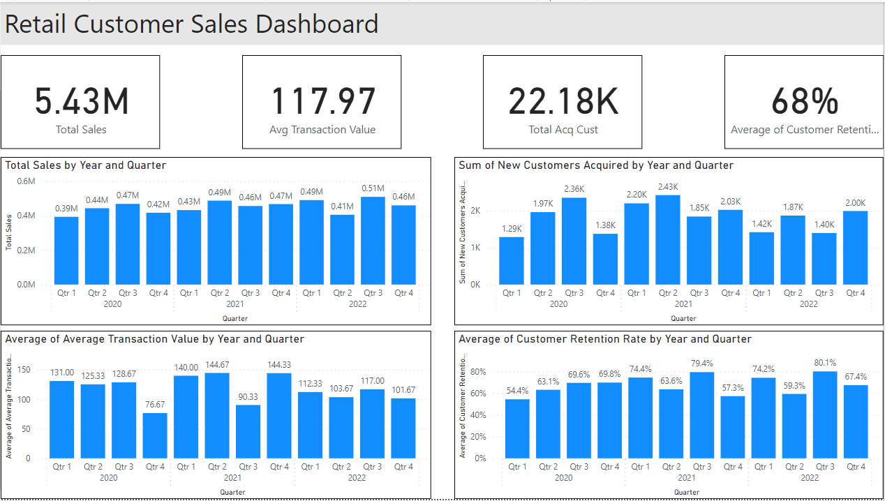

# Retail Dashboard Project

#### **Objective**

The primary objective of this project is to develop a dynamic and interactive dashboard that provides insights into the retail business's monthly performance metrics. Through this dashboard, we aim to empower business leaders and stakeholders with data-driven insights to make informed decisions.

#### **Stakeholders**

- **Business Leaders**: To gauge the business performance and strategize future plans based on the data-driven insights provided by the dashboard.
- **Marketing Teams**: To identify customer demographics and preferences, thereby tailoring marketing strategies effectively.
- **Sales Teams**: To identify peak shopping hours and work towards increasing sales during those periods.

#### **Business Problem**

In the dynamic world of retail, having real-time insights into business metrics is imperative. The business problem we aim to solve is the lack of a centralized system that portrays a holistic view of the business performance, including sales trends, customer demographics, and peak shopping hours, among other metrics. By consolidating all these data points into a singular dashboard, we can foster a data-driven culture and streamline decision-making processes.

#### **Dataset**

The dataset used in this project is synthetically generated and contains over 1000 rows of monthly data from January 2020 to December 2022. It encompasses various KPI metrics such as:

- Monthly Sales
- Average Transaction Value
- Customer Retention Rate
- New Customers Acquired

Moreover, it provides a breakdown of sales across different product categories and customer demographics, offering a granular view of the business dynamics.

#### **Results**

Upon completion, the dashboard will present a clear and intuitive visualization of the various KPIs, allowing for:

- Easy tracking of monthly sales trends.
- Identification of peak shopping hours to optimize staff allocation and marketing strategies.
- Analysis of customer demographics to tailor marketing strategies.

The dashboard is designed to be user-friendly, facilitating easy interpretation of complex data and fostering a data-driven decision-making culture.

#### **Technologies Used**

- **Power BI**: For creating interactive and dynamic visualizations (choose as per your tool).

#### **Future Scope**

- Integration with real-time data sources to provide live updates on the dashboard.
- Implementation of predictive analytics to forecast future sales trends based on historical data.
- Enhancing the dashboard with additional features such as customer feedback analysis and inventory management insights.

#### **Conclusion**

This project stands as a testament to the leveraging power of data in driving business decisions. Through a detailed and interactive dashboard, it brings data-driven insights to the fingertips of business leaders and stakeholders, promoting informed decision-making and fostering business growth.