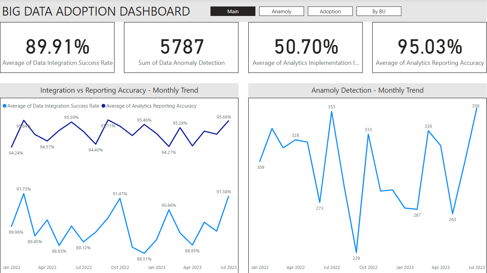

# **Case Study: Development of an Advanced Power BI Dashboard**

#### **Background:**

In a competitive business landscape, data-driven insights are pivotal in steering strategic decisions. Recognizing the pivotal role of data analytics, we took the initiative to develop a Power BI dashboard that would offer an immersive and interactive data visualization experience, offering critical insights into the organization’s operational metrics.

#### **Objective:**

The objective was to develop a dashboard that would amalgamate various key metrics such as Data Integration Success Rate, Data Anomaly Detection, and Analytics Implementation Impact, among others, over a span from January 1, 2022, to July 31, 2023, offering a deep dive into the company’s operational landscape.

### Metrics:
1. **Average Data Integration Success Rate** - A single number indicator showcasing the average success rate over the month.
2. **Total Data Anomalies Detected** - A counter displaying the total number of data anomalies detected throughout the month.
3. **Highest Analytics Implementation Impact** - Display the highest recorded impact from the analytics implementations.
4. **Average Analytics Reporting Accuracy** - A number indicator showing the average reporting accuracy.

### Chart Ideas:
1. **Line Chart** - Plotting daily **Data Integration Success Rate** and **Analytics Reporting Accuracy** to visualize trends and fluctuations over the month.
2. **Bar Chart** - Displaying **Data Anomaly Detection** counts for each day in a bar chart to quickly identify days with higher anomaly counts.
3. **Heat Map** - Creating a heat map to visualize the **Analytics Implementation Impact** over the month, helping identify high impact days at a glance.
4. **Gauge Chart** - Using a gauge chart to visualize the **Big Data Adoption Rate**, showcasing the adoption rate at the end of the month compared to a target rate.

### **Results:**

The dashboard facilitated the following outcomes:

1. **In-depth Insights**: The meticulous selection of metrics ensured that the dashboard offered deep insights into the crucial areas of business operations.
2. **Segmented Analysis**: The inclusion of Department and Business Unit dimensions allowed for a segmented analysis, aiding in pinpointing specific areas for improvements.
3. **Interactive Experience**: The dashboard provided an interactive experience, encouraging users to explore various dimensions and gain comprehensive insights.
   
#### **Conclusion:**

The Power BI dashboard served as a robust tool, offering data-driven insights through a rich visual narrative, aiding in informed decision-making. By encapsulating crucial metrics and facilitating segmented analysis, the dashboard stood as a testimony to an analytical approach, merging technical proficiency with business acumen, ready to drive business strategies with data-driven insights.
